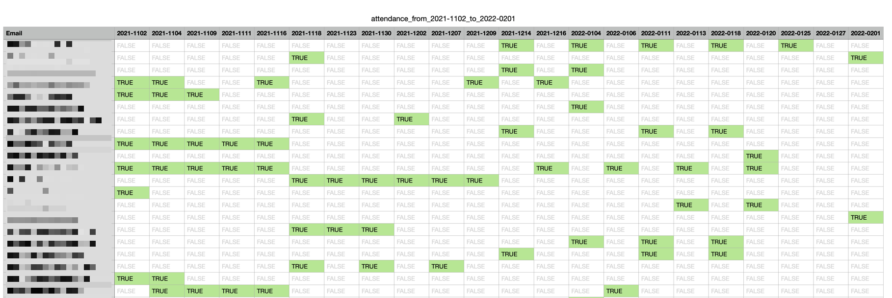

# Attendance Tracker

Takes a series of file with email addresses and a data and creates an attendance tracker.

By default, takes csv files that only contain email addresses. Grouping is taken from the file name (anything before the `_` in the file name).

Optionally, takes csv files in the MS Teams `meetingAttendanceReport.csv` format. These files contain information on meeting date, name and a lot of noise. Email addresses and date are extracted and report is produced.

Output is a `/results/attendance_from_{startDate}_to_{endDate}.csv` csv file in the directory of the input files. These files contains a list of email addreses and columns for each meeting date. Attendance is then marked `True` or `False`.

These files can be opened in a spreadsheet and with some basic _conditional formatting_ you have a nice looking attendance report.



This example covers 22 meetings and over 350 participants.

## Usage

```zsh
usage: attendance_tracker.py [-h] [-t] [<raw-data-file-or-folder>]

Build an attendance list

positional arguments:
  <raw-data-file-or-folder>
                        Include a .csv file or a folder containing .csv
                        files

optional arguments:
  -h, --help            show this help message and exit
  -t, --teams           Process unaltered MS Teams
                        meetingAttendanceReport.csv files
```

## Work in Progress

- [x] Flesh out README.md
- [ ] Trim requirements (lots of dev requirements currently included).
- [ ] Add poetry dependency management
- [ ] 🐞 Fix some cross platform issues. There are directory naming issues on Windows systems
- [ ] Move this list to the issue tracker and create a Project.

## Future Updates

- [ ] Name result file with Company name
- [ ] Take a folder with mixed companies and produce separate reports
- [ ] A config file the allows users to define a meeting title format to parse companies
- [ ] Provide date format customization in the config file
- [ ] Add team/cohort to the parse and optionally produce cohort reports
- [ ] Add support for an option metadata file to include information about meeting topics. Could also provide an option to take meeting topic from meeting name if user indicates that meeting name is useful
- [ ] Add a flag for the current logging verbose output. By default, the output should be a lot less chatty 🤫.
